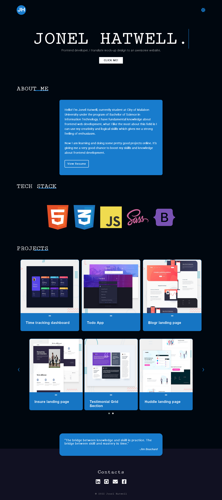
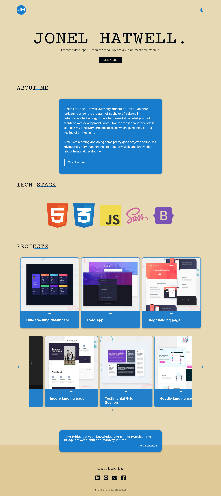

# MY PERSONAL PORTFOLIOa

- I am **Jonel Hatwell** an aspiring frontend developer i hope you will like my works you can see that in my portfolio website :blush:.

## Current Tech Stack

- **_HTML5_**
- **_CSS3_**
- **_JAVASCRIPT_**
- **_BOOTSTRAP5_**
- **_SCSS (CSS PREPROCESSOR)_**

## LIVE SITE

- [Click here]()

## My Social media accounts

- LinkedIn - [Jonel Haatwell](https://www.linkedin.com/in/jonel-hatwell/)
- Facebook - [Jonel Hatwell](https://www.facebook.com/hatwell21/)
- Frontend Mentor - [@hatwell-jonel](https://www.frontendmentor.io/profile/hatwell-jonel)
- You can email at <jnlhatwell@gmail.com>

> The bridge between knowledge and skill is practice. The bridge between skill and mastery is time.
>
> - <cite>Jim Bouchard<cite>

## Overview

- DARK MODE
  
- LIGHT MODE
  
